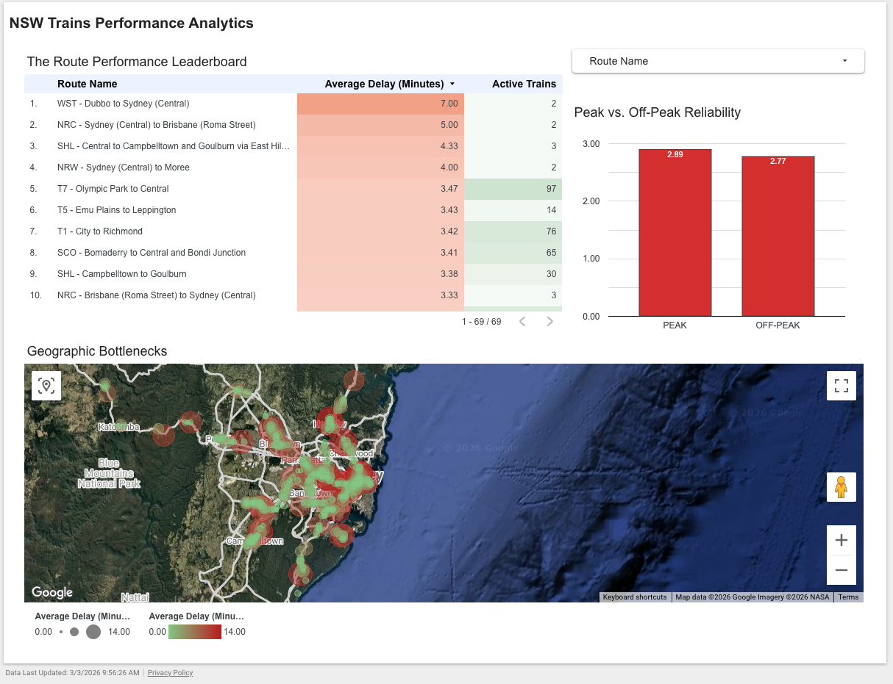
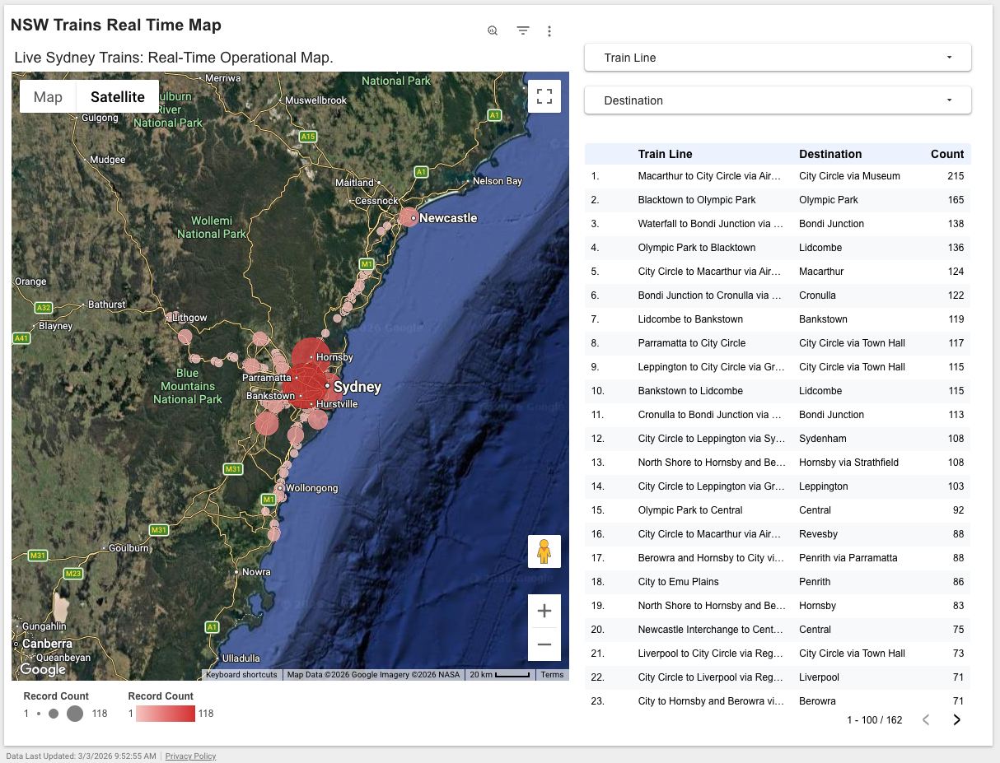

# 🚄 Real-Time Sydney Transit Analytics on GCP

An event-driven, serverless Data Engineering pipeline that ingests real-time GTFS telemetry from Transport for NSW and transforms it into an operational Business Intelligence dashboard.

## 🏛️ Architecture & Tech Stack
This project implements a **Medallion Architecture** (Bronze ➔ Silver ➔ Gold) using a 100% serverless Google Cloud stack to ensure zero idle compute costs and high scalability.

* **Ingestion (Cloud Scheduler & Cloud Run):** Python functions fetch live vehicle positions every 5 minutes and sync static reference schedules weekly.
* **Storage / Bronze Layer (Cloud Storage):** Raw Protobuf/JSON data lands in GCS, decoupling ingestion from transformation and ensuring data durability.
* **Warehouse / Silver & Gold Layers (BigQuery):** External tables read directly from GCS. Partitioned SQL views handle unnesting, data type casting, mock-delay simulation, and spatial geo-clustering.
* **Visualization (Looker Studio):** Native integration with the BigQuery Gold view for real-time geographic monitoring, route density metrics, and bottleneck heatmaps.

## 🛡️ Enterprise Security
* **Zero Trust Credentials:** API keys are not hardcoded. They are securely injected at runtime via **Google Cloud Secret Manager**, utilizing strict IAM Least-Privilege policies (`SecretAccessor` role restricted strictly to the execution service account).

## 📁 Repository Structure
```text
nsw-transit-gcp-serverless/
├── README.md
├── sql/
│   └── gold_layer_views.sql             # BigQuery data warehouse transformations
├── functions/
│   ├── trigger-ingest-nsw-static-metadata/  # Weekly batch ingestion for schedules
│   │   ├── main.py
│   │   └── requirements.txt
│   └── trigger-nws-ingest/                  # 5-minute streaming ingestion for live telemetry
│       ├── main.py
│       └── requirements.txt
```

## 📊 The Dashboard
The BigQuery Gold layer feeds directly into a two-page Looker Studio report:

### 1. Performance Analytics
Route performance leaderboards, peak vs. off-peak reliability tracking, and geographic bottleneck mapping.


### 2. Real-Time Operational Map
Geographic clustering of the active fleet across New South Wales.


## 🚀 V2 Scaling Roadmap
While the V1 architecture utilizes BigQuery SQL views over raw GCS files for rapid prototyping, the V2 roadmap addresses long-term historical storage optimization and CI/CD:

- PySpark Processing: Transitioning from SQL-based Silver layer transformations to local/cloud PySpark to handle complex, stateful aggregations of historical telemetry.
- Apache Iceberg: Converting the storage layer to the Apache Iceberg open table format. This will solve the streaming "small file problem" and provide massive query cost-optimizations when accessed via BigQuery BigLake.
- GitOps CI/CD: Integrating GitHub with Cloud Build to automatically trigger Cloud Run deployments upon pushing new commits to the main branch.